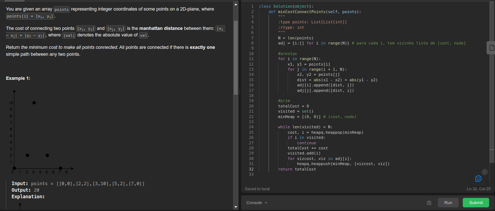
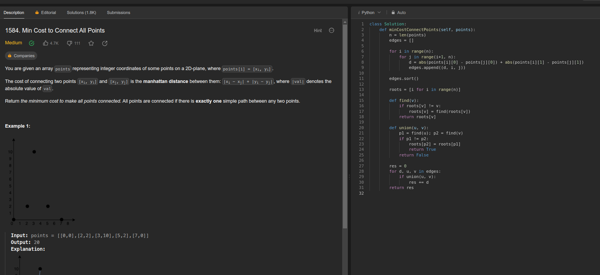
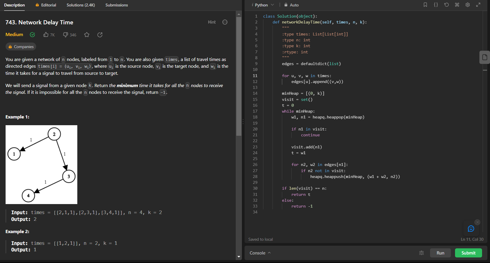
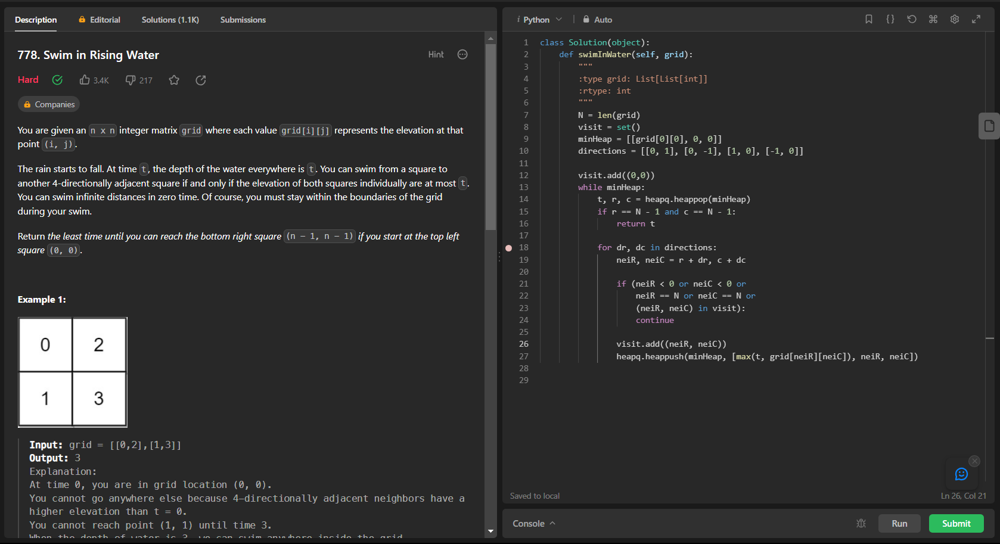

# ExercíciosFAANG

**Número da Lista**: 2 
**Conteúdo da Disciplina**: Grafos2 

## Alunos
|Matrícula | Aluno |
| -- | -- |
| 20/0049020  |  Gabriel Barbosa Alencar |
| 21/1031708  |  Geovane Freitas |

## Sobre 
Este repositório contém a resolução de alguns exercícios de juízes eletrônicos relacionados a Grafos, contemplando os algoritmos de Dijkstra, Prim e Kruskal.

## [Link da Apresentação](https://youtu.be/eGCR8oSkGRw)

https://github.com/projeto-de-algoritmos/Grafos1_LeetCodeExercicios/assets/12275797/e19c3d1a-b0d0-4031-8575-cd653bf4b91b

## Screenshots

## Exercicio 1 - 

Dificuldade: Médio  
Link: [Min Cost to Connect All Points](https://leetcode.com/problems/min-cost-to-connect-all-points/description/))

## Exercicio 2 - 
Dificuldade: Médio  
Link: 

## Exercicio 3 - Network Delay Time
Dificuldade: Médio  
Link: [Network Delay Time](https://leetcode.com/problems/network-delay-time)

Este problema pode ser resolvido utilizando o algoritmo de Dijkstra, que foi o implementado.

## Exercicio 4 -  Swim in Rising Water
Dificuldade: Difícil  
Link: [Swim in Rising Water](https://leetcode.com/problems/swim-in-rising-water)

## Instalação 
**Linguagem**: Python 

Caso queira testar localmente é necessário ter o python instalado
## Uso 
Para verificar o funcionamento basta abrir o link do exercicio e copiar o código referente a questão, e logo após realizar o envio. Caso queira verificar localmente, é necessário adicionar a chamada da função principal com seus devidos paramêtros. para rodar basta utilizar o comando:

`python3 NomeDoArquivo.py`

